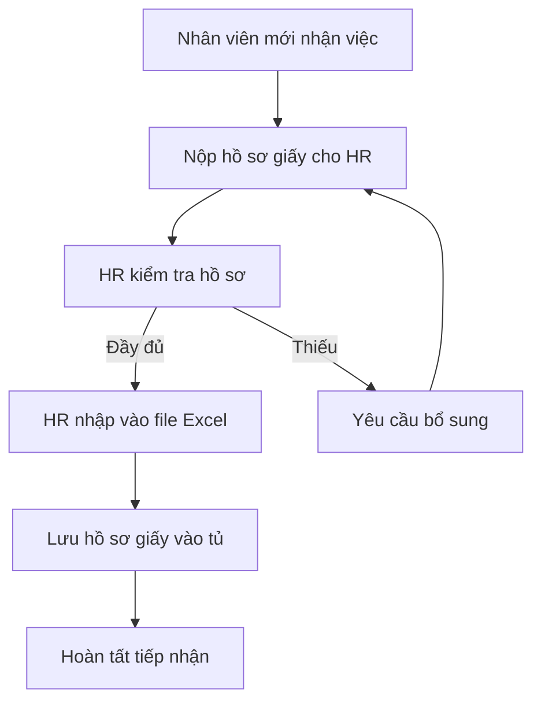
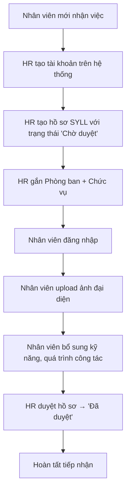

# 5.1.2. Khảo sát thực tế và biểu mẫu thu thập

## 1. Đối tượng khảo sát

Nhóm đã tiến hành khảo sát quy trình quản lý nhân sự tại một số doanh nghiệp vừa và nhỏ (SME) có quy mô từ 20-200 nhân viên để thu thập yêu cầu thực tế.

### 1.1. Các bên liên quan (Stakeholders)

| # | Đối tượng | Vai trò trong doanh nghiệp | Nhu cầu chính |
|---|---|---|---|
| 1 | Ban Giám đốc (BOD) | Quản lý cấp cao | Nắm tổng quan nhân sự, giám sát hoạt động, kiểm toán nội bộ |
| 2 | Phòng Nhân sự (HR) | Chuyên viên quản lý hồ sơ | Tiếp nhận, cập nhật, lưu trữ hồ sơ nhân viên |
| 3 | Trưởng phòng (Manager) | Quản lý phòng ban | Nắm thông tin nhân sự trong phòng mình |
| 4 | Nhân viên (Employee) | Người dùng cuối | Xem và cập nhật hồ sơ cá nhân |

### 1.2. Phương pháp khảo sát
- **Phỏng vấn trực tiếp** chuyên viên HR về quy trình xử lý hồ sơ nhân sự.
- **Quan sát** quy trình tiếp nhận nhân viên mới tại doanh nghiệp.
- **Thu thập biểu mẫu** sơ yếu lý lịch giấy đang sử dụng.
- **Tham khảo** các phần mềm HR hiện có trên thị trường (Base HRM, Amis HR, 1Office).

## 2. Kết quả khảo sát quy trình hiện tại

### 2.1. Quy trình tiếp nhận nhân viên mới (AS-IS)

**Nhược điểm nhận diện được:**
- Phụ thuộc vào file Excel → dễ bị ghi đè, mất dữ liệu.
- Không có phân quyền → ai có quyền truy cập thư mục đều xem/sửa được.
- Không có lịch sử thay đổi → không biết ai sửa gì.
- Tìm kiếm chậm khi số lượng nhân viên tăng.

### 2.2. Quy trình đề xuất (TO-BE)

## 3. Biểu mẫu thu thập

### 3.1. Biểu mẫu Sơ yếu lý lịch (Mẫu chuẩn doanh nghiệp)

Dựa trên mẫu sơ yếu lý lịch được sử dụng phổ biến trong các doanh nghiệp Việt Nam, nhóm đã thu thập và phân loại các nhóm thông tin sau:

#### A. Thông tin cá nhân cơ bản

| # | Trường thông tin | Bắt buộc | Ghi chú |
|---|---|:---:|---|
| 1 | Họ và tên | ✅ | Tối đa 200 ký tự |
| 2 | Tên gọi khác | | Bí danh, tên thường gọi |
| 3 | Ngày sinh | ✅ | Định dạng dd/MM/yyyy |
| 4 | Giới tính | ✅ | Nam / Nữ / Khác |
| 5 | Nơi sinh | | |
| 6 | Quê quán | | |
| 7 | Hộ khẩu thường trú | | |
| 8 | Chỗ ở hiện tại | | |
| 9 | Số điện thoại | ✅ | |
| 10 | Email cá nhân | | |
| 11 | Email công ty | | |
| 12 | Tình trạng hôn nhân | | Độc thân / Đã kết hôn / Ly hôn |
| 13 | Ảnh chân dung | | JPG/PNG, tối đa 2MB |

#### B. Thông tin pháp lý

| # | Trường thông tin | Bắt buộc | Ghi chú |
|---|---|:---:|---|
| 1 | Số CCCD/CMND | | 12 chữ số |
| 2 | Ngày cấp CCCD | | |
| 3 | Nơi cấp CCCD | | |
| 4 | Dân tộc | | |
| 5 | Tôn giáo | | |
| 6 | Mã số thuế | | |
| 7 | Số sổ BHXH | | |
| 8 | Số tài khoản ngân hàng | | |
| 9 | Tên ngân hàng | | |
| 10 | Chi nhánh ngân hàng | | |

#### C. Thông tin công việc

| # | Trường thông tin | Bắt buộc | Ghi chú |
|---|---|:---:|---|
| 1 | Phòng ban | ✅ | Chọn từ danh sách |
| 2 | Chức vụ | ✅ | Chọn từ danh sách |
| 3 | Ngày vào làm | ✅ | |
| 4 | Mã nhân viên | | Tự sinh: NV-XXXX |

#### D. Trình độ học vấn

| # | Trường thông tin | Bắt buộc | Ghi chú |
|---|---|:---:|---|
| 1 | Trình độ phổ thông | | 9/12, 12/12 |
| 2 | Trình độ chuyên môn | ✅ | Trung cấp / Cao đẳng / Đại học / Thạc sĩ / Tiến sĩ |
| 3 | Tên trường | | |
| 4 | Chuyên ngành | | |
| 5 | Năm tốt nghiệp | | |
| 6 | Xếp loại | | Xuất sắc / Giỏi / Khá / Trung bình |
| 7 | Ngoại ngữ | | Loại + trình độ |
| 8 | Tin học | | Loại + trình độ |

#### E. Kỹ năng

- Danh sách kỹ năng tự do (tags), ví dụ: C#, SQL Server, ReactJS, Quản lý dự án...

#### F. Quá trình công tác

| # | Trường thông tin | Bắt buộc | Ghi chú |
|---|---|:---:|---|
| 1 | Tên công ty | ✅ | |
| 2 | Chức danh | ✅ | |
| 3 | Thời gian bắt đầu | ✅ | |
| 4 | Thời gian kết thúc | | Để trống nếu đang làm |
| 5 | Mô tả công việc | | |

#### G. Quan hệ gia đình

| # | Trường thông tin | Bắt buộc | Ghi chú |
|---|---|:---:|---|
| 1 | Quan hệ | ✅ | Bố / Mẹ / Vợ / Chồng / Con... |
| 2 | Họ tên | ✅ | |
| 3 | Năm sinh | | |
| 4 | Nghề nghiệp | | |
| 5 | Nơi công tác | | |
| 6 | Số điện thoại | | |
| 7 | Là liên hệ khẩn cấp | | Checkbox |

#### H. Thông tin Đoàn/Đảng

| # | Trường thông tin | Bắt buộc | Ghi chú |
|---|---|:---:|---|
| 1 | Ngày vào Đoàn | | |
| 2 | Nơi kết nạp Đoàn | | |
| 3 | Ngày vào Đảng | | |
| 4 | Nơi kết nạp Đảng | | |
| 5 | Trạng thái Đảng | | Đảng viên chính thức / Dự bị |

#### I. Tài liệu đính kèm

| # | Trường thông tin | Bắt buộc | Ghi chú |
|---|---|:---:|---|
| 1 | Tên tài liệu | ✅ | |
| 2 | Loại tài liệu | ✅ | Bằng cấp / CCCD / Hợp đồng / Khác |
| 3 | File đính kèm | ✅ | PDF, Word, JPG, PNG - tối đa 10MB |

### 3.2. Biểu mẫu quản lý Phòng ban

| # | Trường | Bắt buộc | Ghi chú |
|---|---|:---:|---|
| 1 | Tên phòng ban | ✅ | Duy nhất |
| 2 | Mã phòng ban | ✅ | Duy nhất, viết tắt (VD: HR, IT, KT) |
| 3 | Mô tả | | |
| 4 | Trưởng phòng | | Chọn từ danh sách User có role Manager |

### 3.3. Biểu mẫu quản lý Chức vụ

| # | Trường | Bắt buộc | Ghi chú |
|---|---|:---:|---|
| 1 | Tên chức vụ | ✅ | |
| 2 | Cấp bậc (Level) | ✅ | Số nguyên, dùng để sắp xếp |
| 3 | Lương cơ bản | ✅ | Đơn vị: VNĐ |
| 4 | Mô tả | | |

### 3.4. Biểu mẫu tài khoản người dùng

| # | Trường | Bắt buộc | Ghi chú |
|---|---|:---:|---|
| 1 | Tên đăng nhập | ✅ | Duy nhất |
| 2 | Họ và tên | ✅ | |
| 3 | Email | ✅ | Duy nhất, dùng để quên mật khẩu |
| 4 | Vai trò | ✅ | Super Admin / HR Admin / Manager / Employee |
| 5 | Trạng thái | ✅ | Hoạt động / Bị khóa |
