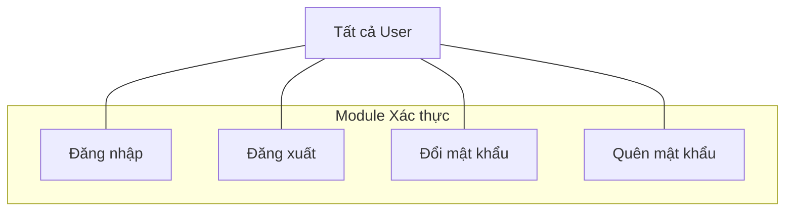
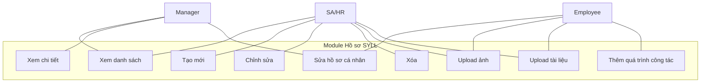

# 5.2.1. Biểu đồ Use-Case

## 1. Use-Case Diagram tổng quan (4 Actors)

```mermaid
graph LR
    SA["🔐 Super Admin"]
    HR["🏢 HR Admin"]
    MG["👔 Manager"]
    EM["👤 Employee"]

    subgraph "Hệ thống QLSYLL"
        UC_AUTH["UC01: Đăng nhập / Đăng xuất"]
        UC_CHPWD["UC02: Đổi mật khẩu"]
        UC_FGPWD["UC03: Quên mật khẩu"]
        UC_DASH_ALL["UC04: Dashboard toàn công ty"]
        UC_DASH_DEPT["UC05: Dashboard phòng ban"]
        UC_DASH_SELF["UC06: Dashboard cá nhân"]
        UC_RES_LIST["UC07: Xem DS hồ sơ"]
        UC_RES_DETAIL["UC08: Xem chi tiết hồ sơ"]
        UC_RES_CREATE["UC09: Tạo hồ sơ mới"]
        UC_RES_EDIT["UC10: Sửa hồ sơ"]
        UC_RES_DEL["UC11: Xóa hồ sơ"]
        UC_SELF_EDIT["UC12: Sửa hồ sơ cá nhân"]
        UC_AVATAR["UC13: Upload ảnh đại diện"]
        UC_DOC["UC14: Upload tài liệu"]
        UC_DEPT["UC15: Quản lý Phòng ban"]
        UC_POS["UC16: Quản lý Chức vụ"]
        UC_USER["UC17: Quản lý Tài khoản"]
        UC_ROLE["UC18: Phân quyền Role"]
        UC_ANN_W["UC19: Đăng / Xóa Thông báo"]
        UC_ANN_R["UC20: Xem thông báo"]
        UC_LOG["UC21: Xem Audit Log"]
        UC_CONTACT["UC22: Danh bạ nội bộ"]
        UC_WORK["UC23: Quá trình công tác"]
    end

    SA --- UC_AUTH
    SA --- UC_CHPWD
    SA --- UC_FGPWD
    SA --- UC_DASH_ALL
    SA --- UC_RES_LIST
    SA --- UC_RES_DETAIL
    SA --- UC_RES_CREATE
    SA --- UC_RES_EDIT
    SA --- UC_RES_DEL
    SA --- UC_DEPT
    SA --- UC_POS
    SA --- UC_USER
    SA --- UC_ROLE
    SA --- UC_ANN_W
    SA --- UC_ANN_R
    SA --- UC_LOG
    SA --- UC_CONTACT

    HR --- UC_AUTH
    HR --- UC_CHPWD
    HR --- UC_FGPWD
    HR --- UC_DASH_ALL
    HR --- UC_RES_LIST
    HR --- UC_RES_DETAIL
    HR --- UC_RES_CREATE
    HR --- UC_RES_EDIT
    HR --- UC_RES_DEL
    HR --- UC_AVATAR
    HR --- UC_DOC
    HR --- UC_USER
    HR --- UC_ANN_W
    HR --- UC_ANN_R
    HR --- UC_CONTACT

    MG --- UC_AUTH
    MG --- UC_CHPWD
    MG --- UC_FGPWD
    MG --- UC_DASH_DEPT
    MG --- UC_RES_LIST
    MG --- UC_RES_DETAIL
    MG --- UC_SELF_EDIT
    MG --- UC_AVATAR
    MG --- UC_ANN_R
    MG --- UC_CONTACT

    EM --- UC_AUTH
    EM --- UC_CHPWD
    EM --- UC_FGPWD
    EM --- UC_DASH_SELF
    EM --- UC_SELF_EDIT
    EM --- UC_AVATAR
    EM --- UC_DOC
    EM --- UC_ANN_R
    EM --- UC_CONTACT
    EM --- UC_WORK
```

## 2. Đặc tả Use-Case chi tiết

### UC01: Đăng nhập

| Thuộc tính | Nội dung |
|---|---|
| **Tên UC** | Đăng nhập hệ thống |
| **Actor** | Super Admin, HR Admin, Manager, Employee |
| **Mô tả** | Người dùng nhập tên đăng nhập và mật khẩu để truy cập hệ thống |
| **Tiền điều kiện** | Tài khoản đã được tạo và đang hoạt động (IsActive = true) |
| **Hậu điều kiện** | Session được tạo, chuyển hướng về Dashboard theo vai trò |
| **Luồng chính** | 1. Người dùng truy cập `/Account/Login`   2. Nhập Username và Password   3. Nhấn "Đăng nhập"   4. Hệ thống kiểm tra Username tồn tại và không bị xóa   5. Hệ thống verify password bằng PasswordHasher   6. Kiểm tra IsActive = true   7. Tạo Session (UserId, Username, FullName, Role)   8. Ghi Audit Log: Action = LOGIN   9. Chuyển hướng: SA/HR → Dashboard, Manager → DashboardDept, Employee → DashboardSelf |
| **Luồng ngoại lệ** | 4a. Username không tồn tại → "Tên đăng nhập hoặc mật khẩu không đúng"   5a. Sai mật khẩu → Thông báo lỗi   6a. Tài khoản bị khóa → "Tài khoản đã bị khóa" |

### UC09: Tạo hồ sơ mới

| Thuộc tính | Nội dung |
|---|---|
| **Tên UC** | Tạo hồ sơ sơ yếu lý lịch mới |
| **Actor** | Super Admin, HR Admin |
| **Mô tả** | Tạo hồ sơ SYLL cho nhân viên mới, tự động gắn với tài khoản chưa có hồ sơ |
| **Tiền điều kiện** | Đã đăng nhập với vai trò SA hoặc HR. Có ít nhất 1 tài khoản chưa được gắn hồ sơ |
| **Hậu điều kiện** | Hồ sơ mới được tạo với trạng thái "Chờ duyệt" |
| **Luồng chính** | 1. Truy cập `/Resume/Create`   2. Điền thông tin cá nhân (Họ tên, Ngày sinh, Giới tính...)   3. Chọn Phòng ban và Chức vụ từ dropdown   4. Điền thông tin học vấn, kỹ năng   5. Nhấn "Lưu"   6. Hệ thống tự tìm tài khoản User chưa có Employee   7. Tạo Employee mới, gắn UserId, Status = "Chờ duyệt"   8. Lưu Education và Skills   9. Chuyển về danh sách + thông báo thành công |
| **Luồng ngoại lệ** | 6a. Không còn tài khoản trống → Thông báo lỗi, redirect về Index |

### UC12: Sửa hồ sơ cá nhân (Employee)

| Thuộc tính | Nội dung |
|---|---|
| **Tên UC** | Nhân viên cập nhật hồ sơ cá nhân |
| **Actor** | Employee, Manager |
| **Mô tả** | Nhân viên tự cập nhật một số trường thông tin cá nhân cho phép |
| **Tiền điều kiện** | Đã đăng nhập. Có hồ sơ Employee gắn với tài khoản |
| **Hậu điều kiện** | Các trường được phép đã được cập nhật |
| **Luồng chính** | 1. Truy cập `/Resume/SelfEdit`   2. Hệ thống load hồ sơ theo UserId trong Session   3. Hiển thị form với các trường: SĐT, Email cá nhân, Địa chỉ, Kỹ năng, Học vấn   4. Nhân viên chỉnh sửa thông tin   5. Nhấn "Cập nhật"   6. Hệ thống chỉ cập nhật: Phone, PersonalEmail, CurrentAddress   7. Lưu Education và Skills   8. Thông báo thành công |
| **Ràng buộc** | KHÔNG cho sửa: FullName, DepartmentId, PositionId, IdentityNumber, JoinDate |

### UC13: Upload ảnh đại diện

| Thuộc tính | Nội dung |
|---|---|
| **Tên UC** | Tải lên ảnh chân dung |
| **Actor** | Tất cả (mỗi người upload ảnh mình; SA/HR upload cho người khác) |
| **Luồng chính** | 1. Chọn file ảnh (JPG/PNG)   2. Hệ thống kiểm tra extension và dung lượng ≤ 2MB   3. Tạo tên file: `{EmployeeId}_{timestamp}.{ext}`   4. Lưu vào `wwwroot/uploads/avatars/`   5. Cập nhật AvatarPath trên Employee   6. Thông báo thành công |
| **Luồng ngoại lệ** | 2a. Sai định dạng → "Chỉ chấp nhận JPG/PNG"   2b. Quá 2MB → "Tối đa 2MB" |

### UC21: Xem Audit Log

| Thuộc tính | Nội dung |
|---|---|
| **Tên UC** | Xem lịch sử thay đổi hệ thống |
| **Actor** | Super Admin |
| **Mô tả** | Xem toàn bộ nhật ký thay đổi dữ liệu trong hệ thống |
| **Tiền điều kiện** | Đăng nhập với vai trò Super Admin |
| **Đặc điểm** | Log là **Append-only** (chỉ INSERT, không UPDATE/DELETE). Hiển thị: Bảng bị tác động, Hành động, Giá trị cũ/mới (JSON), Người thực hiện, IP, Thời gian |

## 3. Use-Case Diagram theo Module

### 3.1. Module Xác thực

### 3.2. Module Hồ sơ SYLL

