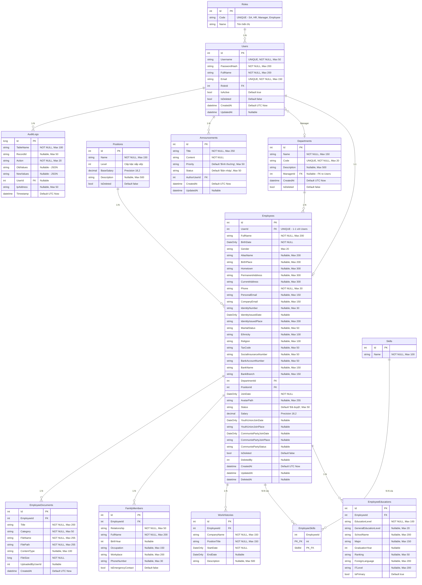

# 5.2.2. Thiết kế Cơ sở dữ liệu

## 1. Sơ đồ quan hệ thực thể (ERD)

> **Lưu ý:** ERD bên dưới phản ánh đúng cấu trúc thực tế trong source code (Entity Framework Code First), không phải tài liệu thiết kế ban đầu.



## 2. Mô tả chi tiết các bảng

### 2.1. Bảng `Roles` (Vai trò)

Lưu trữ danh sách các vai trò trong hệ thống. Dữ liệu được seed cố định.

| Cột | Kiểu | Ràng buộc | Mô tả |
|---|---|---|---|
| Id | INT | PK, Identity | Khóa chính |
| Code | NVARCHAR(30) | NOT NULL, UNIQUE | Mã vai trò: SA, HR, Manager, Employee |
| Name | NVARCHAR(100) | NOT NULL | Tên hiển thị: "Quản trị viên", "Nhân sự"... |

**Dữ liệu mẫu (Seed Data):**

| Id | Code | Name |
|---|---|---|
| 1 | SA | Quản trị viên hệ thống |
| 2 | HR | Quản trị nhân sự |
| 3 | Manager | Trưởng bộ phận |
| 4 | Employee | Nhân viên |

### 2.2. Bảng `Users` (Tài khoản)

| Cột | Kiểu | Ràng buộc | Mô tả |
|---|---|---|---|
| Id | INT | PK, Identity | Khóa chính |
| Username | NVARCHAR(50) | NOT NULL, UNIQUE | Tên đăng nhập |
| PasswordHash | NVARCHAR(200) | NOT NULL | Mật khẩu đã hash (HMAC-SHA256) |
| FullName | NVARCHAR(200) | NOT NULL | Họ tên hiển thị |
| Email | NVARCHAR(150) | NOT NULL, UNIQUE | Email (dùng cho Quên MK) |
| RoleId | INT | FK → Roles | Vai trò |
| IsActive | BIT | Default true | Trạng thái hoạt động |
| IsDeleted | BIT | Default false | Soft delete |
| CreatedAt | DATETIME2 | Default UTC Now | Ngày tạo |
| UpdatedAt | DATETIME2 | Nullable | Ngày cập nhật |

### 2.3. Bảng `Employees` (Hồ sơ nhân viên)

Bảng chính lưu trữ sơ yếu lý lịch. Quan hệ **1-1** với Users.

*(Chi tiết 35+ cột đã được mô tả đầy đủ trong ERD phía trên)*

**Các ràng buộc quan trọng:**
- `UserId` là UNIQUE → mỗi User chỉ có 1 Employee.
- `Salary` có Precision(18, 2) để lưu số tiền chính xác.
- `Status` có 3 giá trị: "Đã duyệt", "Chờ duyệt", "Bị khóa".
- Soft Delete: `IsDeleted`, `DeletedBy`, `DeletedAt`.

### 2.4. Bảng `EmployeeDocuments` (Tài liệu hồ sơ)

Lưu metadata của file tải lên. File vật lý lưu tại `wwwroot/uploads/documents/`.

| Cột | Kiểu | Ràng buộc | Mô tả |
|---|---|---|---|
| Id | INT | PK, Identity | Khóa chính |
| EmployeeId | INT | FK → Employees | Nhân viên sở hữu |
| Title | NVARCHAR(200) | NOT NULL | Tên tài liệu |
| Category | NVARCHAR(50) | NOT NULL, Default "Khac" | Loại: BangCap, CCCD, HopDong, Khac |
| FileName | NVARCHAR(255) | NOT NULL | Tên file gốc |
| FilePath | NVARCHAR(255) | NOT NULL | Đường dẫn web: `/uploads/documents/...` |
| ContentType | NVARCHAR(100) | Nullable | MIME type |
| FileSize | BIGINT | NOT NULL | Dung lượng (bytes) |
| UploadedByUserId | INT | Nullable | Người upload |
| CreatedAt | DATETIME2 | Default UTC Now | Ngày tải lên |

### 2.5. Bảng `AuditLogs` (Nhật ký thay đổi)

Bảng **Append-only** — chỉ INSERT, không UPDATE/DELETE.

| Cột | Kiểu | Ràng buộc | Mô tả |
|---|---|---|---|
| Id | BIGINT | PK, Identity | Khóa chính (BIGINT cho dữ liệu lớn) |
| TableName | VARCHAR(100) | NOT NULL | Tên bảng bị tác động |
| RecordId | VARCHAR(50) | Nullable | ID bản ghi bị tác động |
| Action | VARCHAR(20) | NOT NULL | INSERT / UPDATE / DELETE / LOGIN / LOGOUT |
| OldValues | NVARCHAR(MAX) | Nullable | JSON giá trị cũ |
| NewValues | NVARCHAR(MAX) | Nullable | JSON giá trị mới |
| UserId | INT | FK → Users | Người thực hiện |
| IpAddress | VARCHAR(50) | Nullable | Địa chỉ IP |
| Timestamp | DATETIME2 | Default UTC Now | Thời gian |

## 3. Quan hệ giữa các bảng

| Bảng cha | Bảng con | Kiểu quan hệ | OnDelete |
|---|---|---|---|
| Roles | Users | 1 - N | NoAction |
| Users | Employees | 1 - 1 | Cascade (mặc định EF) |
| Users | Departments.Manager | 1 - N | NoAction |
| Departments | Employees | 1 - N | Cascade (mặc định) |
| Positions | Employees | 1 - N | Cascade (mặc định) |
| Employees | EmployeeEducations | 1 - N | Cascade |
| Employees | EmployeeSkills | N - N (qua bảng trung gian) | Cascade |
| Skills | EmployeeSkills | N - N (qua bảng trung gian) | Cascade |
| Employees | WorkHistories | 1 - N | Cascade |
| Employees | FamilyMembers | 1 - N | Cascade |
| Employees | EmployeeDocuments | 1 - N | Cascade |
| Users | Announcements | 1 - N | NoAction |
| Users | AuditLogs | 1 - N | NoAction |

## 4. Cơ chế Audit Trail tự động

Hệ thống sử dụng **EF Core SaveChangesAsync override** để tự động ghi Audit Log:

```
SaveChangesAsync()
   ├── DetectChanges()
   ├── Lọc entities có State = Added / Modified / Deleted
   ├── Với mỗi entity:
   │   ├── Added   → NewValues = tất cả properties (trừ PK)
   │   ├── Deleted  → OldValues = tất cả properties (trừ PK)
   │   └── Modified → OldValues + NewValues = chỉ properties bị thay đổi
   ├── Tạo AuditLog entries
   ├── base.SaveChangesAsync() → lưu dữ liệu chính
   └── AddRange(auditEntries) + base.SaveChangesAsync() → lưu log
```

**Đặc điểm:**
- Log được lưu trong **cùng transaction** với dữ liệu chính → đảm bảo tính nhất quán.
- Bỏ qua entity `AuditLog` để tránh log vô hạn.
- Ghi nhận `UserId` và `IpAddress` từ `ICurrentRequestContext`.
