# 5.2.3. Sitemap và Wireframe

## 1. Sitemap hệ thống

Sitemap bên dưới thể hiện toàn bộ cấu trúc điều hướng (navigation) của hệ thống theo vai trò:

```mermaid
graph TD
    ROOT["QLSYLL<br/>Hệ thống Quản lý SYLL"]

    ROOT --> LOGIN["/Account/Login<br/>Đăng nhập"]
    ROOT --> FORGOT["/Account/ForgotPassword<br/>Quên mật khẩu"]

    LOGIN --> DASH_ALL["/Admin/Dashboard<br/>Dashboard toàn CTy<br/>👤 SA, HR"]
    LOGIN --> DASH_DEPT["/Admin/DashboardDept<br/>Dashboard phòng ban<br/>👤 Manager"]
    LOGIN --> DASH_SELF["/Admin/DashboardSelf<br/>Dashboard cá nhân<br/>👤 Employee"]

    subgraph "Module Hồ sơ SYLL (SA, HR)"
        RES_INDEX["/Resume/Index<br/>Danh sách hồ sơ"]
        RES_CREATE["/Resume/Create<br/>Thêm hồ sơ"]
        RES_EDIT["/Resume/Edit/id<br/>Sửa hồ sơ"]
        RES_DETAIL["/Resume/Details/id<br/>Chi tiết hồ sơ"]
    end

    subgraph "Module Hồ sơ cá nhân (Employee)"
        SELF_EDIT["/Resume/SelfEdit<br/>Xem/Sửa hồ sơ cá nhân"]
    end

    subgraph "Module Quản lý (SA)"
        DEPT["/Department/Index<br/>Quản lý Phòng ban"]
        DEPT_CREATE["/Department/Create<br/>Thêm phòng ban"]
        DEPT_EDIT["/Department/Edit/id<br/>Sửa phòng ban"]
        POS["/Position/Index<br/>Quản lý Chức vụ"]
        POS_CREATE["/Position/Create<br/>Thêm chức vụ"]
        POS_EDIT["/Position/Edit/id<br/>Sửa chức vụ"]
    end

    subgraph "Module Tài khoản (SA, HR)"
        USER_INDEX["/User/Index<br/>Danh sách tài khoản"]
        USER_CREATE["/User/Create<br/>Tạo tài khoản"]
        USER_EDIT["/User/Edit/id<br/>Sửa tài khoản"]
    end

    subgraph "Module Thông báo"
        ANN_INDEX["/Announcement/Index<br/>Danh sách thông báo<br/>👤 Tất cả"]
        ANN_CREATE["/Announcement/Create<br/>Đăng thông báo<br/>👤 SA, HR"]
        ANN_EDIT["/Announcement/Edit/id<br/>Sửa thông báo<br/>👤 SA, HR"]
    end

    subgraph "Module Tiện ích"
        CONTACT["/Contact/Index<br/>Danh bạ nội bộ<br/>👤 Tất cả"]
        AUDIT["/AuditLog/Index<br/>Nhật ký hệ thống<br/>👤 SA"]
        CHPWD["/Account/ChangePassword<br/>Đổi mật khẩu<br/>👤 Tất cả"]
    end

    DASH_ALL --> RES_INDEX
    DASH_ALL --> DEPT
    DASH_ALL --> USER_INDEX
    DASH_ALL --> ANN_INDEX
    DASH_ALL --> AUDIT

    DASH_DEPT --> RES_INDEX
    DASH_SELF --> SELF_EDIT

    RES_INDEX --> RES_CREATE
    RES_INDEX --> RES_EDIT
    RES_INDEX --> RES_DETAIL
```



## 2. Mô tả Wireframe từng trang chính

> **Ghi chú:** Wireframe bên dưới là mô tả dạng text. Khi nộp báo cáo chính thức, nên dùng **draw.io** hoặc **Figma** để vẽ wireframe đồ họa.

### 2.1. Trang Đăng nhập (`/Account/Login`)

```
┌─────────────────────────────────────────────┐
│              QLSYLL                         │
│       Hệ thống Quản lý Nhân sự             │
│                                             │
│  ┌───────────────────────────────────────┐  │
│  │  Tên đăng nhập: [________________]   │  │
│  │  Mật khẩu:      [________________]   │  │
│  │                                       │  │
│  │  [████ ĐĂNG NHẬP ████]               │  │
│  │                                       │  │
│  │  Quên mật khẩu?                      │  │
│  └───────────────────────────────────────┘  │
│                                             │
└─────────────────────────────────────────────┘
```

### 2.2. Layout chung (Sau đăng nhập)

```
┌──────────────────────────────────────────────────────────┐
│  🏢 QLSYLL            [Tên người dùng ▼] [🔔] [Logout]  │
├────────────┬─────────────────────────────────────────────┤
│            │  Breadcrumb: Dashboard > ...                │
│  SIDEBAR   │─────────────────────────────────────────────│
│            │                                             │
│  📊 Dashb  │     NỘI DUNG CHÍNH                         │
│  📋 Hồ sơ  │                                             │
│  🏢 P.ban  │     (Thay đổi theo từng trang)              │
│  👔 C.vụ   │                                             │
│  👤 T.khoản│                                             │
│  📢 T.báo  │                                             │
│  📒 D.bạ   │                                             │
│  📜 Log    │                                             │
│  🔑 Đổi MK │                                             │
│            │                                             │
└────────────┴─────────────────────────────────────────────┘
```

### 2.3. Dashboard toàn công ty (`/Admin/Dashboard`)

```
┌─────────────────────────────────────────────────────────┐
│  DASHBOARD                                              │
│                                                         │
│  ┌──────────┐ ┌──────────┐ ┌──────────┐ ┌──────────┐  │
│  │👤 Tổng NV│ │🏢 Phòng  │ │📢 Thông  │ │⏳ Chờ    │  │
│  │   XX     │ │ ban: XX  │ │ báo: XX  │ │ duyệt:XX │  │
│  └──────────┘ └──────────┘ └──────────┘ └──────────┘  │
│                                                         │
│  ┌─────────────────────────┐ ┌───────────────────────┐ │
│  │ 📋 NV mới nhất          │ │ 🕐 Hoạt động gần đây  │ │
│  │ ┌─────┬────┬─────┬───┐ │ │ • INSERT Employees #5 │ │
│  │ │Tên  │P.B │C.Vụ │TT │ │ │ • LOGIN Users #3     │ │
│  │ │NV A │ IT │ NV  │✅ │ │ │ • UPDATE Employees #2│ │
│  │ │NV B │ HR │ TP  │⏳ │ │ │ • ...                │ │
│  │ └─────┴────┴─────┴───┘ │ └───────────────────────┘ │
│  └─────────────────────────┘                            │
└─────────────────────────────────────────────────────────┘
```

### 2.4. Danh sách Hồ sơ SYLL (`/Resume/Index`)

```
┌─────────────────────────────────────────────────────────┐
│  HỒ SƠ SƠ YẾU LÝ LỊCH                    [+ Thêm mới]│
│                                                         │
│  🔍 [Tìm kiếm...] [Phòng ban ▼] [Trạng thái ▼] [Lọc] │
│                                                         │
│  ┌───┬──────┬────────┬────┬──────┬──────┬──────┬─────┐ │
│  │ # │ Họ tên│Ngày sinh│G.T│ P.Ban│ C.Vụ │ T.Thái│ ... │ │
│  ├───┼──────┼────────┼────┼──────┼──────┼──────┼─────┤ │
│  │ 1 │NV A  │01/01/90│Nam │ IT   │ NV   │ ✅   │👁✏🗑│ │
│  │ 2 │NV B  │15/03/92│Nữ  │ HR   │ TP   │ ⏳   │👁✏🗑│ │
│  └───┴──────┴────────┴────┴──────┴──────┴──────┴─────┘ │
│                                                         │
│  Hiển thị 1-5 / 20 bản ghi    [◀ 1 2 3 4 ▶]           │
└─────────────────────────────────────────────────────────┘
```

### 2.5. Chi tiết Hồ sơ (`/Resume/Details/{id}`)

```
┌─────────────────────────────────────────────────────────┐
│  CHI TIẾT HỒ SƠ                   [✏ Chỉnh sửa] [← ]  │
│                                                         │
│  ┌─────────────┬────────────────────────────────────┐  │
│  │             │  NGUYỄN VĂN A                      │  │
│  │   [ẢNH]    │  Chức vụ: Nhân viên                │  │
│  │             │  Phòng ban: Phòng IT               │  │
│  │   320px    │  Trạng thái: ✅ Đã duyệt            │  │
│  │             │──────────────────────────────────── │  │
│  │             │  Mã NV     | Ngày vào | Ngày sinh  │  │
│  │             │  NV-0001   | 01/2024  | 01/01/1990 │  │
│  └─────────────┴────────────────────────────────────┘  │
│                                                         │
│  ┌── Thông tin cá nhân ─────────────────────────────┐  │
│  │ Tên khác | Hôn nhân | Nơi sinh | Quê quán | ... │  │
│  └──────────────────────────────────────────────────┘  │
│                                                         │
│  ┌── Thông tin công việc ───────────────────────────┐  │
│  ┌── Pháp lý và phúc lợi ──────────────────────────┐  │
│  ┌── Trình độ học vấn ─────────────────────────────┐   │
│  ┌── Kỹ năng ──────────────────────────────────────┐   │
│  ┌── Tài liệu hồ sơ (Bảng) ───────────────────────┐  │
│  ┌── Quá trình công tác (Bảng) ────────────────────┐  │
│  ┌── Quan hệ gia đình (Bảng) ──────────────────────┐  │
│  ┌── Thông tin Đoàn / Đảng ────────────────────────┐  │
└─────────────────────────────────────────────────────────┘
```

## 3. Cấu trúc điều hướng Sidebar theo vai trò

### Super Admin
| # | Menu | Route | Icon |
|---|---|---|---|
| 1 | Dashboard | /Admin/Dashboard | bi-speedometer2 |
| 2 | Hồ sơ SYLL | /Resume/Index | bi-file-earmark-person |
| 3 | Phòng ban | /Department/Index | bi-building |
| 4 | Chức vụ | /Position/Index | bi-diagram-3 |
| 5 | Tài khoản | /User/Index | bi-people |
| 6 | Thông báo | /Announcement/Index | bi-megaphone |
| 7 | Danh bạ | /Contact/Index | bi-person-lines-fill |
| 8 | Nhật ký | /AuditLog/Index | bi-shield-check |
| 9 | Đổi MK | /Account/ChangePassword | bi-key |

### HR Admin
*(Tương tự SA nhưng KHÔNG có: Phòng ban, Chức vụ, Nhật ký)*

### Manager
| # | Menu | Route |
|---|---|---|
| 1 | Dashboard | /Admin/DashboardDept |
| 2 | Hồ sơ SYLL | /Resume/Index |
| 3 | Thông báo | /Announcement/Index |
| 4 | Danh bạ | /Contact/Index |
| 5 | Đổi MK | /Account/ChangePassword |

### Employee
| # | Menu | Route |
|---|---|---|
| 1 | Trang cá nhân | /Admin/DashboardSelf |
| 2 | Hồ sơ cá nhân | /Resume/SelfEdit |
| 3 | Thông báo | /Announcement/Index |
| 4 | Danh bạ | /Contact/Index |
| 5 | Đổi MK | /Account/ChangePassword |
