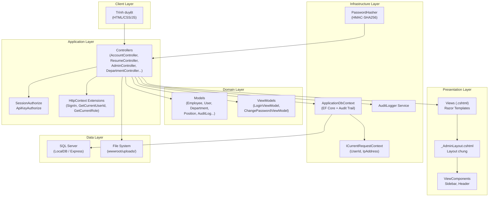

# 5.3.1. Kiến trúc tổng quan hệ thống

## 1. Mô hình kiến trúc MVC

Hệ thống QLSYLL được xây dựng theo mô hình **ASP.NET Core MVC** với kiến trúc phân tầng:



## 2. Cấu trúc thư mục dự án

```
QLSYLL/
├── Controllers/                    # Xử lý logic điều hướng
│   ├── AccountController.cs        # Đăng nhập, đăng xuất, đổi/quên MK
│   ├── AdminController.cs          # Dashboard (3 loại: toàn CTy, phòng ban, cá nhân)
│   ├── ResumeController.cs         # CRUD hồ sơ SYLL (lớn nhất ~760 dòng)
│   ├── DepartmentController.cs     # CRUD Phòng ban
│   ├── PositionController.cs       # CRUD Chức vụ
│   ├── UserController.cs           # Quản lý tài khoản
│   ├── AnnouncementController.cs   # Thông báo nội bộ
│   ├── ContactController.cs        # Danh bạ nội bộ
│   ├── AuditLogController.cs       # Xem nhật ký (SA only)
│   └── Api/                        # RESTful API controllers
├── Models/                         # Entity classes (Code First)
│   ├── Employee.cs                 # 35+ properties, bảng chính
│   ├── User.cs                     # Tài khoản đăng nhập
│   ├── Role.cs                     # Vai trò (SA, HR, Manager, Employee)
│   ├── Department.cs               # Phòng ban
│   ├── Position.cs                 # Chức vụ
│   ├── EmployeeEducation.cs        # Học vấn
│   ├── Skill.cs + EmployeeSkill.cs # Kỹ năng (N-N)
│   ├── WorkHistory.cs              # Quá trình công tác
│   ├── FamilyMember.cs             # Gia đình
│   ├── EmployeeDocument.cs         # Tài liệu đính kèm
│   ├── Announcement.cs             # Thông báo
│   ├── AuditLog.cs                 # Nhật ký thay đổi
│   ├── ApplicationDbContext.cs     # DbContext + Audit Trail override
│   └── ViewModels/                 # Dữ liệu cho form
├── Views/                          # Giao diện Razor
│   ├── Shared/
│   │   └── _AdminLayout.cshtml     # Layout chung (Sidebar + Header)
│   ├── Account/                    # Login, ChangePassword, ForgotPassword
│   ├── Admin/                      # Dashboard, DashboardDept, DashboardSelf
│   ├── Resume/                     # Index, Create, Edit, Details, SelfEdit
│   ├── Department/                 # Index, Create, Edit
│   ├── Position/                   # Index, Create, Edit
│   ├── User/                       # Index, Create, Edit
│   ├── Announcement/               # Index, Create, Edit
│   ├── Contact/                    # Index
│   └── AuditLog/                   # Index
├── ViewComponents/                 # Sidebar component
├── Infrastructure/
│   ├── Auth/                       # SessionAuthorize, ApiKeyAuthorize
│   ├── Security/                   # PasswordHasher
│   ├── Extensions/                 # HttpContext extension methods
│   ├── Services/                   # AuditLogger service
│   ├── RequestContext/             # ICurrentRequestContext
│   └── Data/                       # SeedData
├── wwwroot/
│   ├── css/                        # Stylesheet
│   ├── js/                         # JavaScript
│   ├── lib/                        # Thư viện bên thứ ba
│   └── uploads/
│       ├── avatars/                # Ảnh đại diện
│       └── documents/              # Tài liệu hồ sơ
├── Program.cs                      # Entry point, DI configuration
└── appsettings.json                # Connection string, config
```

## 3. Các thành phần kỹ thuật chính

### 3.1. Phân quyền (Authorization)

Sử dụng **Custom Action Filter** `[SessionAuthorize]`:

```csharp
// Cho phép tất cả role đã đăng nhập
[SessionAuthorize]

// Chỉ cho phép SA và HR
[SessionAuthorize(RoleNames.SuperAdmin, RoleNames.HrAdmin)]

// Cho phép tất cả 4 role
[SessionAuthorize(RoleNames.SuperAdmin, RoleNames.HrAdmin, 
                  RoleNames.Manager, RoleNames.Employee)]
```

### 3.2. Session Management

```
Session["UserId"]    → int    : ID người dùng hiện tại
Session["Username"]  → string : Tên đăng nhập
Session["FullName"]  → string : Họ tên hiển thị
Session["Role"]      → string : Mã vai trò (SA, HR, Manager, Employee)
```

Timeout: 30 phút. Cookie: HttpOnly + IsEssential.

### 3.3. Password Hashing

Sử dụng **HMAC-SHA256** custom implementation:
- `PasswordHasher.HashPassword(plaintext)` → string hash
- `PasswordHasher.VerifyPassword(plaintext, hash)` → bool

### 3.4. Audit Trail

Override `SaveChangesAsync()` trong `ApplicationDbContext`:
- Tự động detect `EntityState.Added / Modified / Deleted`
- Serialize `OldValues` / `NewValues` thành JSON
- Gắn `UserId` và `IpAddress` từ `ICurrentRequestContext`

### 3.5. File Upload

Lưu file vật lý vào `wwwroot/uploads/`:
- Avatars: `wwwroot/uploads/avatars/{employeeId}_{timestamp}.{ext}`
- Documents: `wwwroot/uploads/documents/{employeeId}_{timestamp}.{ext}`
- Serve qua Static Files middleware: `app.UseStaticFiles()`
