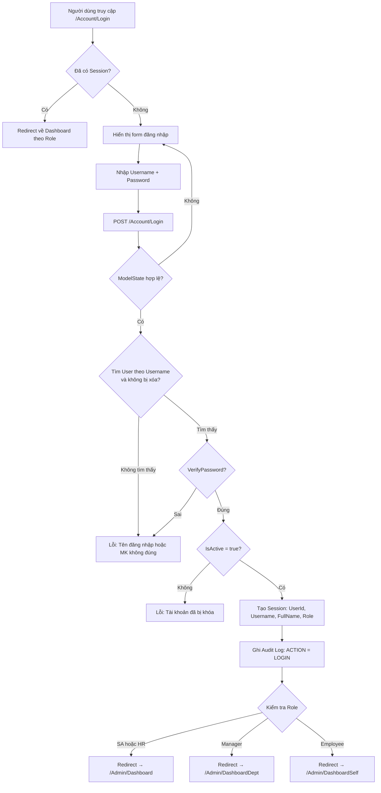
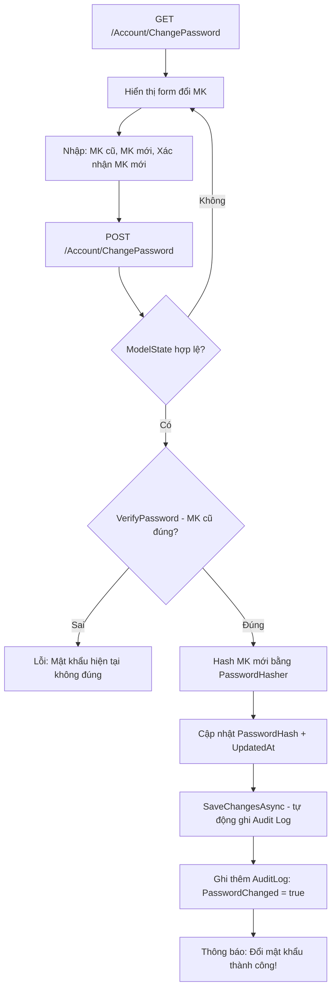
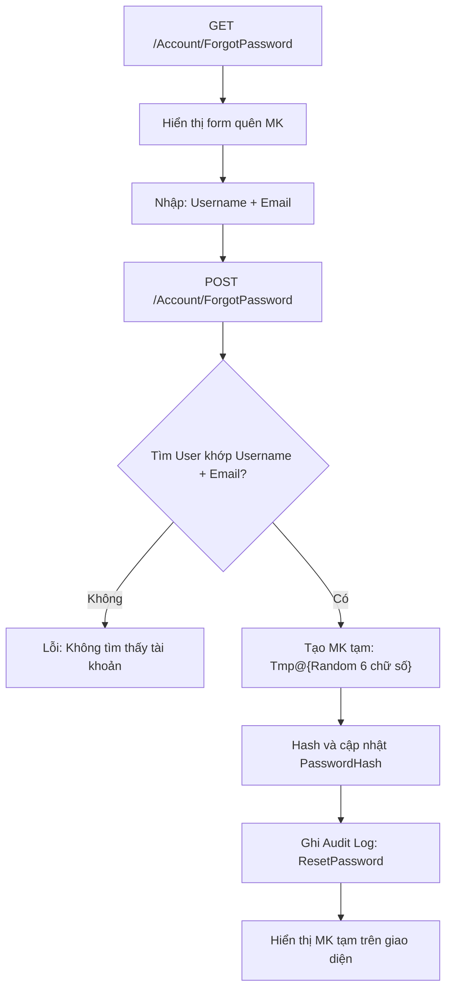

# 5.3.2. Chức năng Xác thực và Phân quyền

## 1. Tổng quan module

Module xác thực xử lý toàn bộ luồng đăng nhập/đăng xuất, đổi mật khẩu, quên mật khẩu và phân quyền truy cập theo vai trò.

**Controller:** `AccountController.cs`  
**Views:** `Views/Account/Login.cshtml`, `ChangePassword.cshtml`, `ForgotPassword.cshtml`

## 2. Chức năng Đăng nhập

### 2.1. Mô tả

Người dùng nhập Username và Password để truy cập hệ thống. Sau khi xác thực thành công, hệ thống tạo Session và chuyển hướng về Dashboard phù hợp với vai trò.

### 2.2. Luồng xử lý



### 2.3. Giao diện

> **📸 Hình ảnh minh họa:** *(Chèn screenshot trang Login tại đây)*
>
> **Mô tả:** Trang đăng nhập với form căn giữa màn hình, bao gồm:
> - Ô nhập "Tên đăng nhập" và "Mật khẩu"
> - Nút "Đăng nhập" màu primary
> - Link "Quên mật khẩu?" phía dưới
> - Hiển thị thông báo lỗi nếu sai thông tin (validation message màu đỏ)
> - Hiển thị thông báo thành công (toast notification) khi logout hoặc đổi MK xong

## 3. Chức năng Đăng xuất

### 3.1. Mô tả
Xóa toàn bộ Session, ghi Audit Log (LOGOUT), chuyển về trang Login.

### 3.2. Luồng xử lý
1. Người dùng nhấn nút "Đăng xuất" trên Header.
2. Hệ thống lấy `UserId` từ Session.
3. Ghi Audit Log: `Action = LOGOUT`.
4. `Session.Clear()` — xóa toàn bộ Session.
5. Hiển thị thông báo "Bạn đã đăng xuất" và redirect về `/Account/Login`.

## 4. Chức năng Đổi mật khẩu

### 4.1. Mô tả
Người dùng đã đăng nhập có thể đổi mật khẩu bằng cách nhập mật khẩu cũ, mật khẩu mới và xác nhận.

### 4.2. Luồng xử lý



### 4.3. Giao diện

> **📸 Hình ảnh minh họa:** *(Chèn screenshot trang Đổi MK tại đây)*
>
> **Mô tả:** Form gồm 3 trường:
> - Mật khẩu hiện tại (password input)
> - Mật khẩu mới (password input)
> - Xác nhận mật khẩu mới (password input)
> - Nút "Đổi mật khẩu" màu primary
> - Validation hiển thị inline dưới mỗi trường

## 5. Chức năng Quên mật khẩu

### 5.1. Mô tả
Người dùng quên mật khẩu có thể yêu cầu hệ thống tạo mật khẩu tạm thời bằng cách xác minh Username + Email.

### 5.2. Luồng xử lý



> **Lưu ý:** Trong phiên bản hiện tại, mật khẩu tạm được hiển thị trực tiếp trên giao diện (dạng TempData). Trong môi trường production, nên gửi qua Email.

## 6. Cơ chế phân quyền (RBAC)

### 6.1. SessionAuthorize Attribute

Hệ thống sử dụng custom `ActionFilterAttribute` để kiểm tra phân quyền:

```
Mỗi request → SessionAuthorize kiểm tra:
  1. Session["UserId"] có tồn tại không? → Nếu không → Redirect Login
  2. Session["Role"] có nằm trong danh sách Role cho phép? → Nếu không → Redirect Login
```

### 6.2. Phân quyền trên từng Controller/Action

| Controller | Action | Roles được phép |
|---|---|---|
| AccountController | Login, Logout, ForgotPassword | Tất cả (không cần đăng nhập) |
| AccountController | ChangePassword | Tất cả (đã đăng nhập) |
| AdminController | Dashboard | SA, HR |
| AdminController | DashboardDept | SA, HR, Manager |
| AdminController | DashboardSelf | SA, HR, Manager, Employee |
| ResumeController | Index, Details | SA, HR, Manager, Employee |
| ResumeController | Create, Edit, Delete | SA, HR |
| ResumeController | SelfEdit, UploadAvatar | Tất cả (đã đăng nhập) |
| DepartmentController | * | SA |
| PositionController | * | SA |
| UserController | * | SA, HR |
| AnnouncementController | Index | SA, HR, Manager, Employee |
| AnnouncementController | Create, Edit, Delete | SA, HR |
| ContactController | Index | SA, HR, Manager, Employee |
| AuditLogController | Index | SA |

### 6.3. Phân quyền logic bổ sung (trong code)

Ngoài `[SessionAuthorize]`, một số action còn kiểm tra logic phân quyền bên trong:

- **Manager xem hồ sơ:** Chỉ được xem nhân viên cùng `DepartmentId`.
- **Employee truy cập Resume/Index:** Tự động redirect về `SelfEdit`.
- **Employee sửa hồ sơ:** Chỉ cập nhật `Phone`, `PersonalEmail`, `CurrentAddress`.
- **HR xóa hồ sơ:** Soft Delete (đánh dấu `IsDeleted`). SA mới được Hard Delete.
- **Danh bạ nội bộ:** SA/HR thấy thông tin nhạy cảm, Manager/Employee không thấy.
