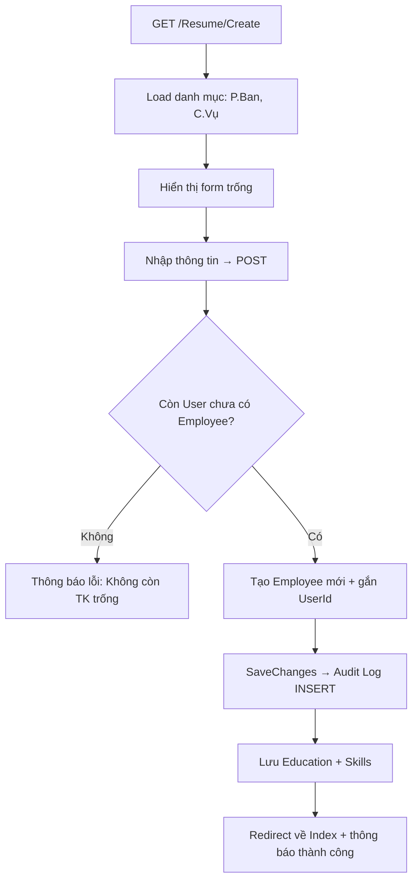

# 5.3.4. Chức năng Quản lý Hồ sơ SYLL

## 1. Tổng quan

Module lớn nhất trong hệ thống (~760 dòng code), xử lý toàn bộ CRUD hồ sơ sơ yếu lý lịch.

**Controller:** `ResumeController.cs`  
**Views:** `Index`, `Create`, `Edit`, `Details`, `SelfEdit`

## 2. Danh sách hồ sơ (`/Resume/Index`)

### 2.1. Chức năng
- Hiển thị danh sách hồ sơ NV với **phân trang** (5 bản ghi/trang mặc định)
- **Tìm kiếm** theo tên hoặc SĐT
- **Lọc** theo Phòng ban và Trạng thái
- Manager: chỉ thấy NV cùng phòng; Employee: redirect về SelfEdit

### 2.2. Giao diện
> **📸 Hình ảnh:** *(Chèn screenshot danh sách hồ sơ)*
>
> **Mô tả:** Bảng gồm các cột: STT, Họ tên, Ngày sinh, Giới tính, SĐT, Phòng ban, Chức vụ, Trạng thái, Hành động (Xem/Sửa/Xóa). Thanh tìm kiếm + bộ lọc phía trên.

## 3. Thêm hồ sơ mới (`/Resume/Create`)

### 3.1. Chức năng
- Chỉ SA và HR mới có quyền
- Form nhập đầy đủ: Thông tin cá nhân, Pháp lý, Công việc, Học vấn, Kỹ năng, Đoàn/Đảng
- Hệ thống tự tìm User chưa có Employee để gắn
- Trạng thái mặc định: "Chờ duyệt"

### 3.2. Luồng xử lý

### 3.3. Giao diện
> **📸 Hình ảnh:** *(Chèn screenshot form thêm hồ sơ)*

## 4. Chỉnh sửa hồ sơ (`/Resume/Edit/{id}`)

### 4.1. Chức năng
- SA/HR sửa toàn bộ trường thông tin
- Hiển thị ảnh đại diện hiện tại + form upload ảnh mới
- Hiển thị danh sách tài liệu đính kèm + form upload tài liệu mới

### 4.2. Giao diện
> **📸 Hình ảnh:** *(Chèn screenshot form chỉnh sửa hồ sơ)*

## 5. Chi tiết hồ sơ (`/Resume/Details/{id}`)

### 5.1. Chức năng
- Hiển thị toàn bộ thông tin hồ sơ ở chế độ **chỉ đọc**
- Layout 2 cột: Ảnh (320px) + Thông tin tổng quan
- 8 card thông tin: Cá nhân, Công việc, Pháp lý, Học vấn, Kỹ năng, Tài liệu, Quá trình công tác, Gia đình, Đoàn/Đảng
- Manager: chỉ xem được NV cùng phòng (kiểm tra `DepartmentId`)

### 5.2. Giao diện
> **📸 Hình ảnh:** *(Chèn screenshot chi tiết hồ sơ)*
>
> **Mô tả:** Card hero phía trên với ảnh đại diện bên trái (320px), thông tin tổng quan bên phải (Họ tên, Chức vụ, Phòng ban, Badge trạng thái). Bên dưới là các card thông tin xếp theo section.

## 6. Hồ sơ cá nhân (`/Resume/SelfEdit`)

### 6.1. Chức năng
- Dành cho Employee tự xem/sửa hồ sơ của mình
- CHỈ cho sửa: SĐT, Email cá nhân, Địa chỉ hiện tại
- Hiển thị thêm: Upload ảnh, Upload tài liệu, Thêm quá trình công tác
- Hiển thị Education và Skills để cập nhật

### 6.2. Giao diện
> **📸 Hình ảnh:** *(Chèn screenshot hồ sơ cá nhân Employee)*

## 7. Upload ảnh đại diện

- **Endpoint tự upload:** `POST /Resume/UploadAvatar` (Employee upload cho mình)
- **Endpoint upload cho NV khác:** `POST /Resume/UploadAvatarForEmployee?id={id}` (SA/HR)
- **Ràng buộc:** JPG/PNG, tối đa 2MB
- **Lưu trữ:** `wwwroot/uploads/avatars/{id}_{timestamp}.{ext}`

## 8. Upload tài liệu hồ sơ

- **Endpoint:** `POST /Resume/UploadDocument`
- **Ràng buộc:** PDF, Word, JPG, PNG — tối đa 10MB
- **Metadata lưu DB:** Title, Category, FileName, FilePath, ContentType, FileSize
- **Xóa tài liệu:** `POST /Resume/DeleteDocument` — xóa cả file vật lý + bản ghi DB
