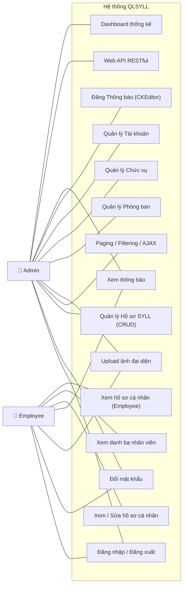

# YÊU CẦU NGHIỆP VỤ & CHỨC NĂNG
## Hệ thống Quản lý Sơ yếu lý lịch

---

## 0. Sơ đồ Use Case tổng quan

---

## 1. Các lớp người dùng (User Roles)

### 1.1 Quản trị viên (Admin)
- Quản lý toàn bộ hồ sơ sơ yếu lý lịch trong hệ thống.
- Thêm, sửa, xóa thông tin nhân viên và hồ sơ.
- Quản lý danh mục: Phòng ban, Chức vụ, Trình độ học vấn.
- Đăng thông báo nội bộ (sử dụng Rich Text Editor).
- Xem báo cáo thống kê tổng hợp.
- Xuất dữ liệu qua API.

### 1.2 Nhân viên (Employee)
- Đăng nhập vào hệ thống.
- Xem và cập nhật sơ yếu lý lịch cá nhân của mình.
- Upload/thay đổi ảnh đại diện.
- Xem danh bạ nhân viên trong công ty (chỉ thông tin cơ bản).
- Xem thông báo nội bộ.

---

## 2. Danh sách chức năng chi tiết

### 2.1 Module Xác thực & Phân quyền (Authentication & Authorization)
| Mã | Chức năng | Mô tả | Vai trò |
|----|-----------|-------|---------|
| AUTH-01 | Đăng nhập | Người dùng nhập tài khoản/mật khẩu để truy cập hệ thống. Lưu thông tin vào Session. | Admin, Employee |
| AUTH-02 | Nhớ mật khẩu | Checkbox "Nhớ tài khoản" sử dụng Cookies để ghi nhớ thông tin đăng nhập. | Admin, Employee |
| AUTH-03 | Đăng xuất | Xóa Session, hủy Cookie và chuyển hướng về trang đăng nhập. | Admin, Employee |
| AUTH-04 | Phân quyền | Kiểm tra vai trò (Role) trong Session trước khi cho phép truy cập trang. Admin → toàn quyền. Employee → chỉ xem/sửa hồ sơ cá nhân. | Hệ thống |
| AUTH-05 | Đổi mật khẩu | Người dùng nhập mật khẩu cũ, mật khẩu mới và xác nhận mật khẩu mới. Hệ thống kiểm tra và cập nhật. | Admin, Employee |

### 2.2 Module Quản lý Sơ yếu lý lịch (Resume Management)
| Mã | Chức năng | Mô tả | Vai trò |
|----|-----------|-------|---------|
| RES-01 | Xem danh sách hồ sơ | Hiển thị danh sách hồ sơ SYLL với **phân trang (Paging)** và **tìm kiếm/lọc (Filtering)**. Dữ liệu được tải bằng **AJAX** không reload trang. | Admin |
| RES-02 | Xem chi tiết hồ sơ | Xem toàn bộ thông tin SYLL của một nhân viên bao gồm: thông tin cá nhân, học vấn, kinh nghiệm, kỹ năng, gia đình. | Admin, Employee (chỉ hồ sơ của mình) |
| RES-03 | Thêm hồ sơ mới | Nhập thông tin SYLL cho nhân viên mới. Có **Validation** bằng Data Annotations. | Admin |
| RES-04 | Cập nhật hồ sơ | Chỉnh sửa thông tin SYLL hiện tại. Nhân viên chỉ được sửa hồ sơ của chính mình. | Admin, Employee |
| RES-05 | Xóa hồ sơ | Xóa hồ sơ SYLL (có xác nhận trước khi xóa). | Admin |
| RES-06 | Upload ảnh đại diện | Tải lên ảnh chân dung cho hồ sơ. Hỗ trợ định dạng JPG, PNG. Lưu file vào thư mục `/Uploads/Avatars/`. | Admin, Employee |

### 2.3 Module Thông tin Sơ yếu lý lịch chi tiết
Mỗi hồ sơ SYLL bao gồm các nhóm thông tin sau:

#### A. Thông tin cá nhân (Personal Info)
| Trường | Kiểu dữ liệu | Bắt buộc | Ghi chú |
|--------|---------------|----------|---------|
| Họ và tên | Nvarchar(100) | ✅ | |
| Ngày sinh | Date | ✅ | |
| Giới tính | Nvarchar(10) | ✅ | Nam/Nữ/Khác |
| CCCD/CMND | Varchar(12) | ✅ | Duy nhất |
| Nơi sinh | Nvarchar(200) | | |
| Quê quán | Nvarchar(200) | | |
| Dân tộc | Nvarchar(50) | | |
| Tôn giáo | Nvarchar(50) | | |
| Địa chỉ thường trú | Nvarchar(300) | ✅ | |
| Địa chỉ tạm trú | Nvarchar(300) | | |
| Số điện thoại | Varchar(15) | ✅ | |
| Email | Varchar(100) | ✅ | Validation email format |
| Ảnh đại diện | Nvarchar(300) | | Đường dẫn file upload |
| Tình trạng hôn nhân | Nvarchar(30) | | Độc thân / Đã kết hôn / Khác |

#### B. Quá trình học vấn (Education)
| Trường | Kiểu dữ liệu | Bắt buộc | Ghi chú |
|--------|---------------|----------|---------|
| Tên trường | Nvarchar(200) | ✅ | |
| Chuyên ngành | Nvarchar(200) | ✅ | |
| Trình độ | Nvarchar(50) | ✅ | THPT / Trung cấp / Cao đẳng / Đại học / Thạc sĩ / Tiến sĩ |
| Năm bắt đầu | Int | ✅ | |
| Năm kết thúc | Int | | Để trống nếu đang học |
| Xếp loại tốt nghiệp | Nvarchar(50) | | Xuất sắc / Giỏi / Khá / TB |

#### C. Kinh nghiệm làm việc (Work Experience)
| Trường | Kiểu dữ liệu | Bắt buộc | Ghi chú |
|--------|---------------|----------|---------|
| Tên công ty | Nvarchar(200) | ✅ | |
| Chức vụ | Nvarchar(100) | ✅ | |
| Từ ngày | Date | ✅ | |
| Đến ngày | Date | | Để trống nếu đang làm |
| Mô tả công việc | Ntext | | **Sử dụng Rich Text Editor** |

#### D. Kỹ năng & Chứng chỉ (Skills & Certifications)
| Trường | Kiểu dữ liệu | Bắt buộc | Ghi chú |
|--------|---------------|----------|---------|
| Tên kỹ năng/Chứng chỉ | Nvarchar(200) | ✅ | |
| Loại | Nvarchar(50) | ✅ | Kỹ năng / Chứng chỉ |
| Mức độ | Nvarchar(50) | | Cơ bản / Trung bình / Thành thạo / Chuyên gia |
| Ngày cấp | Date | | Chỉ áp dụng cho Chứng chỉ |
| Nơi cấp | Nvarchar(200) | | |

#### E. Thông tin gia đình (Family Members)
| Trường | Kiểu dữ liệu | Bắt buộc | Ghi chú |
|--------|---------------|----------|---------|
| Họ và tên | Nvarchar(100) | ✅ | |
| Quan hệ | Nvarchar(50) | ✅ | Bố / Mẹ / Vợ / Chồng / Con / Anh chị em |
| Năm sinh | Int | | |
| Nghề nghiệp | Nvarchar(100) | | |
| Địa chỉ | Nvarchar(300) | | |

### 2.4 Module Quản lý Danh mục (Category Management)
| Mã | Chức năng | Mô tả | Vai trò |
|----|-----------|-------|---------|
| CAT-01 | Quản lý Phòng ban | CRUD danh sách phòng ban (Tên phòng ban, Mô tả). | Admin |
| CAT-02 | Quản lý Chức vụ | CRUD danh sách chức vụ (Tên chức vụ, Mô tả). | Admin |

### 2.5 Module Quản lý Tài khoản (User Account Management)
| Mã | Chức năng | Mô tả | Vai trò |
|----|-----------|-------|---------|
| USR-01 | Xem danh sách tài khoản | Hiển thị danh sách tất cả tài khoản người dùng (Username, FullName, Role, IsActive). | Admin |
| USR-02 | Tạo tài khoản mới | Tạo tài khoản cho nhân viên mới với mật khẩu mặc định. | Admin |
| USR-03 | Khóa/Mở khóa tài khoản | Thay đổi trạng thái `IsActive` của tài khoản. Tài khoản bị khóa không thể đăng nhập. | Admin |
| USR-04 | Reset mật khẩu | Admin đặt lại mật khẩu về giá trị mặc định cho nhân viên. | Admin |

### 2.6 Module Thông báo (Announcements)
| Mã | Chức năng | Mô tả | Vai trò |
|----|-----------|-------|---------|
| ANN-01 | Đăng thông báo | Admin soạn thông báo nội bộ, nội dung sử dụng **Rich Text Editor (CKEditor)**. | Admin |
| ANN-02 | Xem thông báo | Hiển thị danh sách thông báo, có phân trang. | Admin, Employee |
| ANN-03 | Xóa thông báo | Xóa thông báo đã đăng. | Admin |

### 2.7 Module API (RESTful Web API)
| Mã | Endpoint | Method | Mô tả |
|----|----------|--------|-------|
| API-01 | `/api/resumes` | GET | Lấy danh sách hồ sơ SYLL (hỗ trợ query param: page, pageSize, search). |
| API-02 | `/api/resumes/{id}` | GET | Lấy chi tiết một hồ sơ SYLL theo ID. |
| API-03 | `/api/resumes` | POST | Tạo hồ sơ SYLL mới. |
| API-04 | `/api/resumes/{id}` | PUT | Cập nhật hồ sơ SYLL. |
| API-05 | `/api/resumes/{id}` | DELETE | Xóa hồ sơ SYLL. |
| API-06 | `/api/departments` | GET | Lấy danh sách phòng ban. |
| API-07 | `/api/positions` | GET | Lấy danh sách chức vụ. |

### 2.8 Module Dashboard (Trang tổng quan)
| Mã | Chức năng | Mô tả | Vai trò |
|----|-----------|-------|---------|
| DASH-01 | Thống kê tổng quan | Hiển thị: Tổng nhân viên, Số phòng ban, Thông báo gần đây. | Admin |
| DASH-02 | Trang cá nhân | Nhân viên thấy hồ sơ SYLL của mình và thông báo mới nhất. | Employee |

---

## 3. Quy tắc nghiệp vụ (Business Rules)
1. Mỗi nhân viên chỉ có **duy nhất một** hồ sơ sơ yếu lý lịch.
2. Số CCCD/CMND phải là **duy nhất** trong toàn hệ thống.
3. Nhân viên chỉ được xem và chỉnh sửa hồ sơ **của chính mình**, không thể xem/sửa hồ sơ người khác.
4. Chỉ Admin mới có quyền **tạo mới** và **xóa** hồ sơ.
5. Ảnh upload phải có định dạng `.jpg`, `.jpeg`, hoặc `.png` và dung lượng tối đa **2MB**.
6. Ngày sinh phải hợp lệ (không lớn hơn ngày hiện tại, tuổi tối thiểu 16).
7. Khi xóa một hồ sơ, toàn bộ thông tin liên quan (học vấn, kinh nghiệm, kỹ năng, gia đình) sẽ bị xóa theo (Cascade Delete).
8. Tài khoản bị khóa (`IsActive = false`) không thể đăng nhập vào hệ thống.
9. Mật khẩu mới khi đổi phải có tối thiểu **6 ký tự**, bao gồm ít nhất 1 chữ hoa và 1 số.
