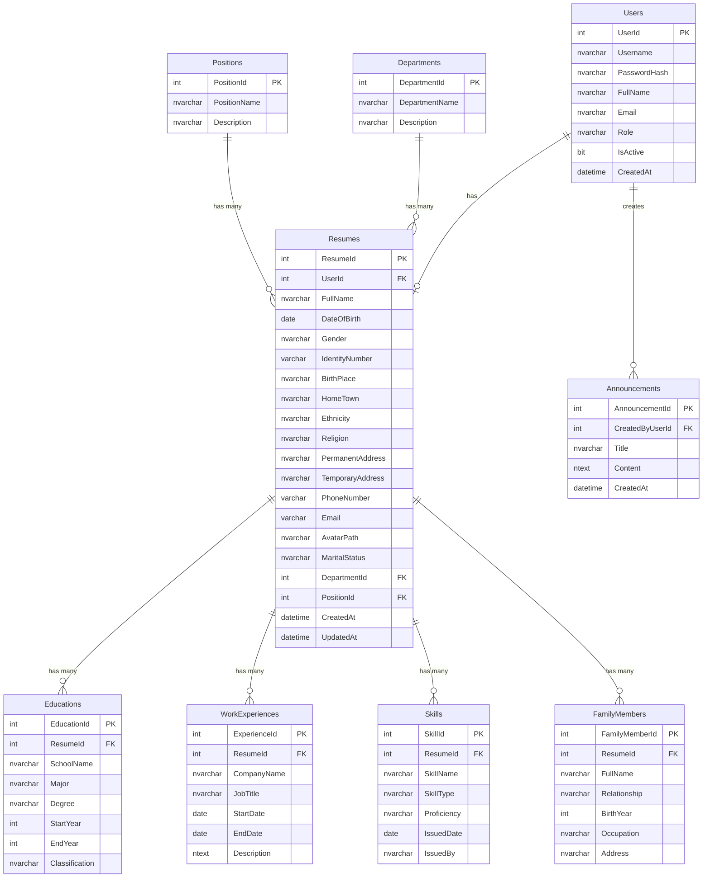

# THIẾT KẾ CƠ SỞ DỮ LIỆU
## Hệ thống Quản lý Sơ yếu lý lịch

---

## 1. Sơ đồ quan hệ thực thể (ER Diagram)



---

## 2. Chi tiết các bảng

### 2.1 Bảng Users (Tài khoản người dùng)
| Cột | Kiểu dữ liệu | Ràng buộc | Mô tả |
|-----|---------------|-----------|-------|
| UserId | INT | PK, Identity | Mã người dùng |
| Username | NVARCHAR(50) | NOT NULL, UNIQUE | Tên đăng nhập |
| PasswordHash | NVARCHAR(256) | NOT NULL | Mật khẩu đã mã hóa |
| FullName | NVARCHAR(100) | NOT NULL | Họ và tên (hiển thị trên Header) |
| Email | VARCHAR(100) | NULL | Email liên hệ |
| Role | NVARCHAR(20) | NOT NULL, DEFAULT 'Employee' | Vai trò: Admin / Employee |
| IsActive | BIT | NOT NULL, DEFAULT 1 | Trạng thái hoạt động |
| CreatedAt | DATETIME | NOT NULL, DEFAULT GETDATE() | Ngày tạo |

### 2.2 Bảng Resumes (Sơ yếu lý lịch)
| Cột | Kiểu dữ liệu | Ràng buộc | Mô tả |
|-----|---------------|-----------|-------|
| ResumeId | INT | PK, Identity | Mã hồ sơ |
| UserId | INT | FK → Users, UNIQUE | Liên kết tài khoản (1-1) |
| FullName | NVARCHAR(100) | NOT NULL | Họ và tên |
| DateOfBirth | DATE | NOT NULL | Ngày sinh |
| Gender | NVARCHAR(10) | NOT NULL | Giới tính |
| IdentityNumber | VARCHAR(12) | NOT NULL, UNIQUE | Số CCCD/CMND |
| BirthPlace | NVARCHAR(200) | NULL | Nơi sinh |
| HomeTown | NVARCHAR(200) | NULL | Quê quán |
| Ethnicity | NVARCHAR(50) | NULL | Dân tộc |
| Religion | NVARCHAR(50) | NULL | Tôn giáo |
| PermanentAddress | NVARCHAR(300) | NOT NULL | Địa chỉ thường trú |
| TemporaryAddress | NVARCHAR(300) | NULL | Địa chỉ tạm trú |
| PhoneNumber | VARCHAR(15) | NOT NULL | Số điện thoại |
| Email | VARCHAR(100) | NOT NULL | Email |
| AvatarPath | NVARCHAR(300) | NULL | Đường dẫn ảnh đại diện |
| MaritalStatus | NVARCHAR(30) | NULL | Tình trạng hôn nhân |
| DepartmentId | INT | FK → Departments, NULL | Phòng ban |
| PositionId | INT | FK → Positions, NULL | Chức vụ |
| CreatedAt | DATETIME | NOT NULL, DEFAULT GETDATE() | Ngày tạo hồ sơ |
| UpdatedAt | DATETIME | NULL | Ngày cập nhật cuối |

### 2.3 Bảng Educations (Quá trình học vấn)
| Cột | Kiểu dữ liệu | Ràng buộc | Mô tả |
|-----|---------------|-----------|-------|
| EducationId | INT | PK, Identity | Mã bản ghi |
| ResumeId | INT | FK → Resumes, NOT NULL | Liên kết hồ sơ |
| SchoolName | NVARCHAR(200) | NOT NULL | Tên trường |
| Major | NVARCHAR(200) | NOT NULL | Chuyên ngành |
| Degree | NVARCHAR(50) | NOT NULL | Trình độ |
| StartYear | INT | NOT NULL | Năm bắt đầu |
| EndYear | INT | NULL | Năm kết thúc |
| Classification | NVARCHAR(50) | NULL | Xếp loại tốt nghiệp |

### 2.4 Bảng WorkExperiences (Kinh nghiệm làm việc)
| Cột | Kiểu dữ liệu | Ràng buộc | Mô tả |
|-----|---------------|-----------|-------|
| ExperienceId | INT | PK, Identity | Mã bản ghi |
| ResumeId | INT | FK → Resumes, NOT NULL | Liên kết hồ sơ |
| CompanyName | NVARCHAR(200) | NOT NULL | Tên công ty |
| JobTitle | NVARCHAR(100) | NOT NULL | Chức vụ |
| StartDate | DATE | NOT NULL | Ngày bắt đầu |
| EndDate | DATE | NULL | Ngày kết thúc |
| Description | NTEXT | NULL | Mô tả công việc (Rich Text) |

### 2.5 Bảng Skills (Kỹ năng & Chứng chỉ)
| Cột | Kiểu dữ liệu | Ràng buộc | Mô tả |
|-----|---------------|-----------|-------|
| SkillId | INT | PK, Identity | Mã bản ghi |
| ResumeId | INT | FK → Resumes, NOT NULL | Liên kết hồ sơ |
| SkillName | NVARCHAR(200) | NOT NULL | Tên kỹ năng/chứng chỉ |
| SkillType | NVARCHAR(50) | NOT NULL | Loại: Kỹ năng / Chứng chỉ |
| Proficiency | NVARCHAR(50) | NULL | Mức độ thành thạo |
| IssuedDate | DATE | NULL | Ngày cấp (chứng chỉ) |
| IssuedBy | NVARCHAR(200) | NULL | Nơi cấp |

### 2.6 Bảng FamilyMembers (Thông tin gia đình)
| Cột | Kiểu dữ liệu | Ràng buộc | Mô tả |
|-----|---------------|-----------|-------|
| FamilyMemberId | INT | PK, Identity | Mã bản ghi |
| ResumeId | INT | FK → Resumes, NOT NULL | Liên kết hồ sơ |
| FullName | NVARCHAR(100) | NOT NULL | Họ và tên |
| Relationship | NVARCHAR(50) | NOT NULL | Quan hệ |
| BirthYear | INT | NULL | Năm sinh |
| Occupation | NVARCHAR(100) | NULL | Nghề nghiệp |
| Address | NVARCHAR(300) | NULL | Địa chỉ |

### 2.7 Bảng Departments (Phòng ban)
| Cột | Kiểu dữ liệu | Ràng buộc | Mô tả |
|-----|---------------|-----------|-------|
| DepartmentId | INT | PK, Identity | Mã phòng ban |
| DepartmentName | NVARCHAR(100) | NOT NULL, UNIQUE | Tên phòng ban |
| Description | NVARCHAR(300) | NULL | Mô tả |

### 2.8 Bảng Positions (Chức vụ)
| Cột | Kiểu dữ liệu | Ràng buộc | Mô tả |
|-----|---------------|-----------|-------|
| PositionId | INT | PK, Identity | Mã chức vụ |
| PositionName | NVARCHAR(100) | NOT NULL, UNIQUE | Tên chức vụ |
| Description | NVARCHAR(300) | NULL | Mô tả |

### 2.9 Bảng Announcements (Thông báo)
| Cột | Kiểu dữ liệu | Ràng buộc | Mô tả |
|-----|---------------|-----------|-------|
| AnnouncementId | INT | PK, Identity | Mã thông báo |
| CreatedByUserId | INT | FK → Users, NOT NULL | Người tạo |
| Title | NVARCHAR(200) | NOT NULL | Tiêu đề |
| Content | NTEXT | NOT NULL | Nội dung (Rich Text HTML) |
| CreatedAt | DATETIME | NOT NULL, DEFAULT GETDATE() | Ngày tạo |

---

## 3. Script tạo Database (SQL Server)

```sql
-- Tạo Database
CREATE DATABASE QLSYLL;
GO
USE QLSYLL;
GO

-- Bảng Users
CREATE TABLE Users (
    UserId INT IDENTITY(1,1) PRIMARY KEY,
    Username NVARCHAR(50) NOT NULL UNIQUE,
    PasswordHash NVARCHAR(256) NOT NULL,
    FullName NVARCHAR(100) NOT NULL,
    Email VARCHAR(100) NULL,
    Role NVARCHAR(20) NOT NULL DEFAULT 'Employee',
    IsActive BIT NOT NULL DEFAULT 1,
    CreatedAt DATETIME NOT NULL DEFAULT GETDATE()
);

-- Bảng Departments
CREATE TABLE Departments (
    DepartmentId INT IDENTITY(1,1) PRIMARY KEY,
    DepartmentName NVARCHAR(100) NOT NULL UNIQUE,
    Description NVARCHAR(300) NULL
);

-- Bảng Positions
CREATE TABLE Positions (
    PositionId INT IDENTITY(1,1) PRIMARY KEY,
    PositionName NVARCHAR(100) NOT NULL UNIQUE,
    Description NVARCHAR(300) NULL
);

-- Bảng Resumes
CREATE TABLE Resumes (
    ResumeId INT IDENTITY(1,1) PRIMARY KEY,
    UserId INT NOT NULL UNIQUE,
    FullName NVARCHAR(100) NOT NULL,
    DateOfBirth DATE NOT NULL,
    Gender NVARCHAR(10) NOT NULL,
    IdentityNumber VARCHAR(12) NOT NULL UNIQUE,
    BirthPlace NVARCHAR(200) NULL,
    HomeTown NVARCHAR(200) NULL,
    Ethnicity NVARCHAR(50) NULL,
    Religion NVARCHAR(50) NULL,
    PermanentAddress NVARCHAR(300) NOT NULL,
    TemporaryAddress NVARCHAR(300) NULL,
    PhoneNumber VARCHAR(15) NOT NULL,
    Email VARCHAR(100) NOT NULL,
    AvatarPath NVARCHAR(300) NULL,
    MaritalStatus NVARCHAR(30) NULL,
    DepartmentId INT NULL,
    PositionId INT NULL,
    CreatedAt DATETIME NOT NULL DEFAULT GETDATE(),
    UpdatedAt DATETIME NULL,
    FOREIGN KEY (UserId) REFERENCES Users(UserId),
    FOREIGN KEY (DepartmentId) REFERENCES Departments(DepartmentId) ON DELETE SET NULL,
    FOREIGN KEY (PositionId) REFERENCES Positions(PositionId) ON DELETE SET NULL
);

-- Bảng Educations
CREATE TABLE Educations (
    EducationId INT IDENTITY(1,1) PRIMARY KEY,
    ResumeId INT NOT NULL,
    SchoolName NVARCHAR(200) NOT NULL,
    Major NVARCHAR(200) NOT NULL,
    Degree NVARCHAR(50) NOT NULL,
    StartYear INT NOT NULL,
    EndYear INT NULL,
    Classification NVARCHAR(50) NULL,
    FOREIGN KEY (ResumeId) REFERENCES Resumes(ResumeId) ON DELETE CASCADE
);

-- Bảng WorkExperiences
CREATE TABLE WorkExperiences (
    ExperienceId INT IDENTITY(1,1) PRIMARY KEY,
    ResumeId INT NOT NULL,
    CompanyName NVARCHAR(200) NOT NULL,
    JobTitle NVARCHAR(100) NOT NULL,
    StartDate DATE NOT NULL,
    EndDate DATE NULL,
    Description NTEXT NULL,
    FOREIGN KEY (ResumeId) REFERENCES Resumes(ResumeId) ON DELETE CASCADE
);

-- Bảng Skills
CREATE TABLE Skills (
    SkillId INT IDENTITY(1,1) PRIMARY KEY,
    ResumeId INT NOT NULL,
    SkillName NVARCHAR(200) NOT NULL,
    SkillType NVARCHAR(50) NOT NULL,
    Proficiency NVARCHAR(50) NULL,
    IssuedDate DATE NULL,
    IssuedBy NVARCHAR(200) NULL,
    FOREIGN KEY (ResumeId) REFERENCES Resumes(ResumeId) ON DELETE CASCADE
);

-- Bảng FamilyMembers
CREATE TABLE FamilyMembers (
    FamilyMemberId INT IDENTITY(1,1) PRIMARY KEY,
    ResumeId INT NOT NULL,
    FullName NVARCHAR(100) NOT NULL,
    Relationship NVARCHAR(50) NOT NULL,
    BirthYear INT NULL,
    Occupation NVARCHAR(100) NULL,
    Address NVARCHAR(300) NULL,
    FOREIGN KEY (ResumeId) REFERENCES Resumes(ResumeId) ON DELETE CASCADE
);

-- Bảng Announcements
CREATE TABLE Announcements (
    AnnouncementId INT IDENTITY(1,1) PRIMARY KEY,
    CreatedByUserId INT NOT NULL,
    Title NVARCHAR(200) NOT NULL,
    Content NTEXT NOT NULL,
    CreatedAt DATETIME NOT NULL DEFAULT GETDATE(),
    FOREIGN KEY (CreatedByUserId) REFERENCES Users(UserId)
);

-- =============================================
-- DỮ LIỆU MẪU (Seed Data)
-- =============================================

-- Tài khoản Admin mặc định (Password: Admin@123 - cần hash khi code thực tế)
INSERT INTO Users (Username, PasswordHash, FullName, Email, Role) VALUES
('admin', 'HASH_CUA_Admin@123', N'Quản trị viên', 'admin@qlsyll.com', 'Admin');

-- Tài khoản Employee mẫu (Password: Nv@123 - cần hash khi code thực tế)
INSERT INTO Users (Username, PasswordHash, FullName, Email, Role) VALUES
('nhanvien01', 'HASH_CUA_Nv@123', N'Nguyễn Văn A', 'nguyenvana@email.com', 'Employee'),
('nhanvien02', 'HASH_CUA_Nv@123', N'Trần Thị B', 'tranthib@email.com', 'Employee');

-- Phòng ban mẫu
INSERT INTO Departments (DepartmentName, Description) VALUES
(N'Phòng Nhân sự', N'Quản lý tuyển dụng và nhân sự'),
(N'Phòng Kỹ thuật', N'Phát triển sản phẩm và kỹ thuật'),
(N'Phòng Kinh doanh', N'Bán hàng và phát triển thị trường'),
(N'Phòng Kế toán', N'Quản lý tài chính và kế toán');

-- Chức vụ mẫu
INSERT INTO Positions (PositionName, Description) VALUES
(N'Giám đốc', N'Giám đốc điều hành'),
(N'Trưởng phòng', N'Quản lý phòng ban'),
(N'Phó phòng', N'Phó phòng ban'),
(N'Nhân viên', N'Nhân viên chính thức'),
(N'Thực tập sinh', N'Nhân viên thực tập');

GO
```

---

## 4. Quan hệ giữa các bảng
| Bảng cha | Bảng con | Quan hệ | Hành vi xóa |
|----------|----------|---------|-------------|
| Users | Resumes | 1 - 1 | Restrict (không cho xóa User khi còn Resume) |
| Resumes | Educations | 1 - N | CASCADE (xóa Resume → xóa tất cả Education) |
| Resumes | WorkExperiences | 1 - N | CASCADE |
| Resumes | Skills | 1 - N | CASCADE |
| Resumes | FamilyMembers | 1 - N | CASCADE |
| Departments | Resumes | 1 - N | SET NULL |
| Positions | Resumes | 1 - N | SET NULL |
| Users | Announcements | 1 - N | Restrict |
