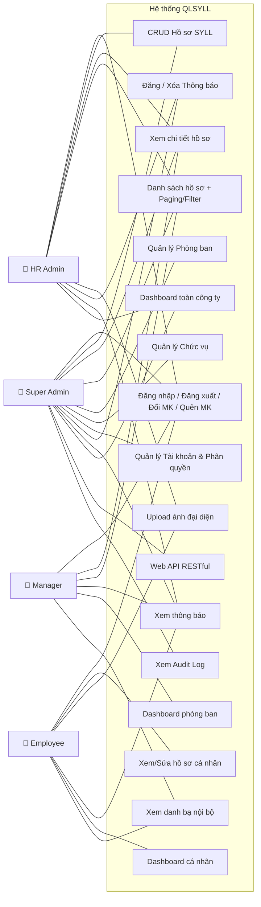

# YÊU CẦU NGHIỆP VỤ: VAI TRÒ, KIỂM THỬ VÀ QUẢN TRỊ LOG

Tài liệu này làm rõ chức năng, nhiệm vụ của từng Actor, phân quyền chi tiết theo từng module, phương pháp kiểm tra, và thiết kế Audit Trail cho hệ thống QLNS.

---

## 1. Sơ đồ Use Case tổng quan (4 Actors)

---

## 2. Phân định Vai trò (Actors) — Chức năng & Nhiệm vụ chi tiết

### 2.1 Quản trị viên hệ thống (Super Admin / BOD)

**Thường là:** Giám đốc (BOD) hoặc Quản trị viên IT cấp cao.

| Module | Chức năng cụ thể | Quyền |
|--------|-------------------|-------|
| **Xác thực** | Đăng nhập, Đăng xuất, Đổi mật khẩu, **Quên mật khẩu** (AUTH-01→05) | ✅ Full |
| **Hồ sơ SYLL** | Xem danh sách toàn bộ nhân viên, Tạo/Sửa/Xóa hồ sơ bất kỳ (RES-01→06) | ✅ Full — Scope: **Toàn công ty** |
| **Phòng ban** | Tạo/Sửa/Xóa phòng ban (CAT-01) | ✅ Full |
| **Chức vụ** | Tạo/Sửa/Xóa chức vụ (CAT-02) | ✅ Full |
| **Tài khoản** | Tạo tài khoản, Phân quyền Role, Reset MK, Khóa/Mở khóa (USR-01→04) | ✅ Full |
| **Thông báo** | Đăng/Sửa/Xóa thông báo (ANN-01→03) | ✅ Full |
| **Dashboard** | Xem thống kê toàn công ty (DASH-01) | ✅ Full |
| **Web API** | Truy cập tất cả endpoint (API-01→07) | ✅ Full |
| **Audit Log** | Xem toàn bộ lịch sử thay đổi, tìm kiếm, xuất báo cáo | ✅ Chỉ Xem (Read-only, không sửa/xóa) |

**Nhiệm vụ đặc thù:**
- Là người duy nhất có quyền **phân quyền Role** cho user khác (gán ai làm HR Admin, ai làm Manager).
- Chịu trách nhiệm **giám sát Audit Log** để phát hiện thao tác bất thường (VD: HR tự sửa lương của mình).
- Thiết lập cấu hình hệ thống ban đầu (Master Data: phòng ban, chức vụ).

### 2.2 Quản trị viên Nhân sự (HR Admin)

**Thường là:** Trưởng/Phó phòng Nhân sự, Chuyên viên HR.

| Module | Chức năng cụ thể | Quyền |
|--------|-------------------|-------|
| **Xác thực** | Đăng nhập, Đăng xuất, Đổi mật khẩu, **Quên mật khẩu** | ✅ Full |
| **Hồ sơ SYLL** | Xem danh sách, Tạo mới, Cập nhật hồ sơ (RES-01→04, RES-06) | ✅ Tạo/Sửa/Xem — Scope: **Toàn công ty** |
| **Xóa hồ sơ** | Xóa hồ sơ SYLL (RES-05) | ⚠️ Chỉ đánh dấu Soft Delete, cần Super Admin duyệt xóa vĩnh viễn |
| **Thông báo** | Đăng/Xóa thông báo nội bộ (ANN-01→03) | ✅ Full |
| **Dashboard** | Xem thống kê toàn công ty (DASH-01) | ✅ Full |
| **Phòng ban/Chức vụ** | Xem danh mục (CAT-01, CAT-02) | 👁️ Chỉ Xem |
| **Tài khoản** | Tạo tài khoản nhân viên mới, Reset MK (USR-02, USR-04) | ⚠️ Hạn chế — KHÔNG được gán Role SuperAdmin |
| **Audit Log** | — | ❌ Không có quyền |
| **Phân quyền Role** | — | ❌ Không có quyền |

**Nhiệm vụ đặc thù:**
- **Quy trình tiếp nhận nhân viên mới:** Tạo tài khoản (USR-02) → Tạo hồ sơ SYLL (RES-03) → Upload ảnh (RES-06) → Gắn Phòng ban & Chức vụ.
- **Quy trình nghỉ việc:** Cập nhật trạng thái hồ sơ → Khóa tài khoản (USR-03) → Lưu ngày nghỉ việc.
- **Quy trình chuyển phòng ban:** Cập nhật DepartmentId trên hồ sơ (hệ thống tự ghi Audit Log giá trị cũ/mới).
- Đảm bảo thông tin nhân sự chính xác, cập nhật để phục vụ tính lương, đóng BHXH.

### 2.3 Trưởng bộ phận (Manager / Head of Department)

**Thường là:** Trưởng phòng IT, Trưởng phòng Marketing, Trưởng phòng Kế toán...

| Module | Chức năng cụ thể | Quyền |
|--------|-------------------|-------|
| **Xác thực** | Đăng nhập, Đăng xuất, Đổi mật khẩu, **Quên mật khẩu** | ✅ Full |
| **Hồ sơ SYLL** | Xem danh sách, Xem chi tiết (RES-01, RES-02) | 👁️ Chỉ Xem — Scope: **CHỈ nhân viên cùng phòng ban** |
| **Hồ sơ phòng khác** | Xem/Sửa/Xóa hồ sơ nhân viên phòng ban khác | ❌ **TUYỆT ĐỐI KHÔNG** (VD: Trưởng IT ❌ xem Marketing) |
| **Tạo/Sửa/Xóa hồ sơ** | RES-03, RES-04, RES-05 | ❌ Không có quyền (Manager chỉ *đề xuất* thay đổi qua email/luồng ngoài, HR thực hiện) |
| **Thông báo** | Xem thông báo (ANN-02) | 👁️ Chỉ Xem |
| **Dashboard** | Xem thống kê phòng ban mình (DASH-DEPT) | 👁️ Scope: Phòng ban |
| **Danh bạ** | Xem thông tin liên lạc cơ bản toàn công ty | 👁️ Chỉ Xem (Họ tên, Email, SĐT, Phòng ban) |

**Nhiệm vụ đặc thù:**
- Theo dõi nhân sự phòng ban mình (số lượng, kỹ năng, chứng chỉ) để lập kế hoạch nhân lực.
- Phối hợp với HR khi cần tuyển dụng, điều chuyển, hoặc xử lý kỷ luật nhân viên. Manager chỉ có quyền Read-only trên hệ thống hiện tại, mọi đề xuất thay đổi sẽ báo qua HR.
- **Quy tắc Kiêm nhiệm:** Nếu một nhân viên thuộc nhiều phòng ban (trong tương lai), trưởng bộ phận của *tất cả* các phòng ban đó đều có quyền xem hồ sơ của nhân viên này. (Với thiết kế 1-1 hiện tại, chỉ 1 Manager xem được).

### 2.4 Nhân viên (Employee)

**Thường là:** Tất cả nhân viên cấp dưới trong các phòng ban.

| Module | Chức năng cụ thể | Quyền |
|--------|-------------------|-------|
| **Xác thực** | Đăng nhập, Đăng xuất, Đổi mật khẩu, **Quên mật khẩu** | ✅ Full |
| **Hồ sơ cá nhân** | Xem chi tiết, Cập nhật hồ sơ (RES-02, RES-04) | ⚠️ **Hạn chế:** Chỉ sửa được SĐT, Địa chỉ, Email cá nhân, Kỹ năng, Học vấn. KHÔNG sửa được Phòng ban, Chức vụ, CCCD. |
| **Hồ sơ người khác** | — | ❌ **TUYỆT ĐỐI KHÔNG** |
| **Upload ảnh** | Tải lên/thay đổi ảnh đại diện (RES-06) | ✅ Chỉ ảnh của mình |
| **Thông báo** | Xem thông báo (ANN-02) | 👁️ Chỉ Xem |
| **Dashboard** | Xem trang cá nhân — hồ sơ + thông báo mới (DASH-02) | 👁️ Scope: Cá nhân |
| **Danh bạ** | Xem thông tin công khai của đồng nghiệp | 👁️ Chỉ thấy: Họ tên, Email, SĐT, Phòng ban. ❌ KHÔNG thấy: CCCD, ngày sinh, gia đình, lương |

**Nhiệm vụ đặc thù:**
- Tự chịu trách nhiệm cập nhật đúng thông tin cá nhân (địa chỉ mới, bằng cấp mới, chứng chỉ mới đạt được).
- Đổi mật khẩu định kỳ để bảo mật tài khoản. Sử dụng "Quên mật khẩu" nếu mất quyền truy cập (Hệ thống gửi Email reset).

---

## 3. Bảng Ma trận Phân quyền tổng hợp (Permission Matrix)

| Chức năng | Super Admin | HR Admin | Manager | Employee |
|-----------|:-----------:|:--------:|:-------:|:--------:|
| **Đăng nhập / Đăng xuất / Đổi MK / Quên MK** | ✅ | ✅ | ✅ | ✅ |
| **Xem danh sách hồ sơ (toàn CTy)** | ✅ | ✅ | ❌ | ❌ |
| **Xem danh sách hồ sơ (phòng mình)** | ✅ | ✅ | ✅ | ❌ |
| **Xem chi tiết hồ sơ người khác** | ✅ | ✅ | 👁️ Phòng mình | ❌ |
| **Xem hồ sơ cá nhân** | ✅ | ✅ | ✅ | ✅ |
| **Sửa hồ sơ cá nhân (Các trường nhạy cảm*)** | ✅ | ✅ | ❌ (Báo HR) | ❌ (Báo HR) |
| **Sửa hồ sơ cá nhân (SĐT, Địa chỉ, Bằng cấp)**| ✅ | ✅ | ✅ | ✅ |
| **Tạo mới / Xóa hồ sơ** | ✅ | ✅ (Xóa: Soft) | ❌ | ❌ |
| **Upload ảnh đại diện** | ✅ | ✅ | ✅ Ảnh mình | ✅ Ảnh mình |
| **Quản lý Phòng ban / Chức vụ (CRUD)** | ✅ | 👁️ Xem | ❌ | ❌ |
| **Quản lý Tài khoản (Tạo, Khóa, Reset MK)** | ✅ | ✅ | ❌ | ❌ |
| **Phân quyền Role** | ✅ | ❌ | ❌ | ❌ |
| **Đăng / Xóa Thông báo** | ✅ | ✅ | ❌ | ❌ |
| **Xem thông báo** | ✅ | ✅ | ✅ | ✅ |
| **Dashboard** | ✅ Toàn CTy | ✅ Toàn CTy | ✅ Phòng ban | ✅ Cá nhân |
| **Xem Audit Log** | ✅ | ❌ | ❌ | ❌ |
| **Xem danh bạ nội bộ** | ✅ | ✅ | ✅ | ✅ |

> *Trường nhạy cảm: Phòng ban, Chức vụ, Số CCCD, Trạng thái hoạt động, Ngày vào làm.

---

## 4. Kiểm thử phân quyền (Test Cases)

*(Các Test Cases cho Super Admin, HR Admin, Manager, Employee giữ nguyên tính chất, bổ sung test Quên MK và Sửa trường nhạy cảm).*

### Test Employee & Chức năng chung
| # | Kịch bản | Kỳ vọng |
|---|----------|---------|
| EM-01 | Quên mật khẩu → Nhập Email | Hệ thống gửi link reset pass về email, user tự đổi MK thành công. |
| EM-02 | Employee vào trang Sửa hồ sơ cá nhân | Thấy Form sửa. KHÔNG THẤY (hoặc bị disable) các trường: Phòng ban, Chức vụ, CCCD. |
| EM-03 | Employee cố tình dùng API PUT để đổi `DepartmentId` của mình | Hệ thống bỏ qua tham số `DepartmentId` hoặc báo lỗi 403 Forbidden cho trường dữ liệu đó. |
| MG-01 | Trưởng phòng IT có nhân sự A thuộc phòng IT và Kế toán | Trưởng phòng IT và Trưởng phòng Kế toán đều xem được hồ sơ nhân sự A. |

---

## 5. Quản trị Log thay đổi (Audit Trail)

### 5.1 Tại sao phải quản trị Log?
- **Minh bạch trách nhiệm:** Biết chính xác ai đã đổi Chức vụ, Phòng ban, hoặc thông tin nhạy cảm của nhân viên.
- **Bảo mật (Security Tracking):** Theo dõi lịch sử Login/Logout để phát hiện đăng nhập bất thường.
- **Phục hồi dữ liệu:** Lấy lại giá trị cũ nếu HR lỡ tay sửa sai.
- **Tuân thủ (Compliance):** Phục vụ kiểm toán nội bộ. **Retention Policy:** Log được lưu trữ vĩnh viễn (hoặc tối thiểu 5 năm theo luật lao động), chỉ Super Admin mới có quyền chuyển log cũ sang Cold Storage (Archive), tuyệt đối không xóa.

### 5.2 Cấu trúc bảng `AuditLogs`

Bảng lưu trữ dạng Append-only (chỉ INSERT, không UPDATE/DELETE).

| Column | Kiểu dữ liệu | Ý nghĩa |
|--------|--------------|---------|
| `Id` | BIGINT (PK) | Khóa chính |
| `TableName` | VARCHAR(100) | Tên bảng bị tác động (`Resumes`, `Users`...) |
| `RecordId` | VARCHAR(50) | ID bản ghi bị tác động |
| `Action` | VARCHAR(20) | `INSERT` / `UPDATE` / `DELETE` / **`LOGIN`** / **`LOGOUT`** |
| `OldValues` | NVARCHAR(MAX) | JSON các trường trước khi sửa (NULL nếu INSERT/LOGIN) |
| `NewValues` | NVARCHAR(MAX) | JSON các trường sau khi sửa (NULL nếu DELETE/LOGOUT) |
| `UserId` | INT | ID người thực hiện thao tác |
| `IpAddress` | VARCHAR(50) | Địa chỉ IP thiết bị |
| `Timestamp` | DATETIME | Thời gian thao tác (giờ Server) |

### 5.3 Nguyên tắc xử lý Log

1. **Chỉ lưu trường thay đổi (JSON diff):**
   - VD: HR sửa SĐT → `OldValues: {"Phone":"0901234567"}`, `NewValues: {"Phone":"0988888888"}`.
2. **Theo dõi Đăng nhập (Login Tracking):**
   - Khi user Login thành công, ghi 1 dòng: Action = `LOGIN`, `UserId` = id, `IpAddress` = IP hiện tại.
3. **Ghi Log tự động bằng EF Interceptors:**
   - Override `SaveChanges()` trong `AppDbContext` để tự động quét `EntityState.Modified/Added/Deleted` và sinh `AuditLog` trong cùng Transaction.
4. **Log là Bất biến (Immutable):**
   - Không ai được Sửa/Xóa log qua giao diện.
   - ConnectionString của ứng dụng Web không có quyền `UPDATE`/`DELETE` trên bảng `AuditLogs`.

### 5.4 Test Audit Log

| # | Kịch bản | Kỳ vọng |
|---|----------|---------|
| LOG-01 | Nhân viên A đăng nhập hệ thống | AuditLog: Action=`LOGIN`, UserId=A, ghi nhận IP Address |
| LOG-02 | HR đổi Chức vụ NV từ "Nhân viên" sang "Trưởng phòng" | AuditLog: Action=`UPDATE`, OldValues=`{"PositionId":2}`, NewValues=`{"PositionId":1}` |
| LOG-03 | Super Admin xóa hồ sơ | AuditLog: Action=`DELETE`, OldValues chứa toàn bộ data cuối cùng |
| LOG-04 | Cố tìm API endpoint sửa/xóa log | Không tồn tại endpoint nào cho phép thay đổi log |
